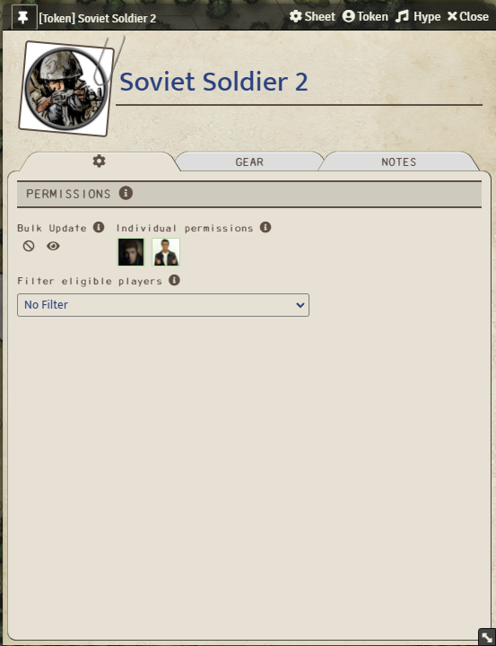
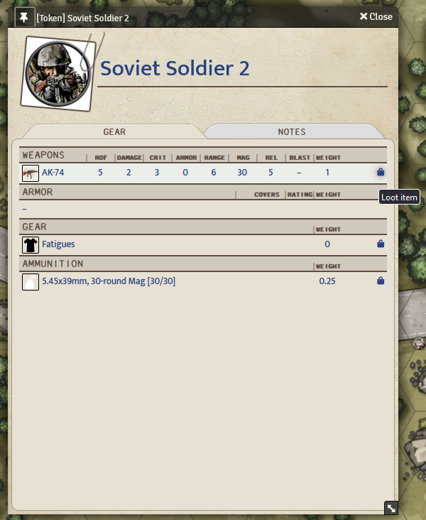

 
<!--  -->
# T2K4E Loot Sheet NPC

This module adds an NPC sheet which can be used for loot containers such as chests or corpses in your game. It has a permission system that allows observers to take loot actions which will automatically process the item transaction. 

### History

This version is based from jopeek's module for DND5E (https://github.com/jopeek/fvtt-loot-sheet-npc-5e).

### Features

Allows for easy assembly of items to be distributed to players.

More features detailed below.

#### Permissions
Permissions can be set in the sheet for each player and range from no access (cannot open sheet) or observer (view sheet and contents and utilize loot buttons).

[//]: # (Permissions Tab)

#### Looting
Players given Observer permission are allowed to freely loot from loot sheet NPC. All items looted are displayed in the chat.

[//]: # (Gear Tab)

#### Compendiums
* There is a macros compendium included with macros that will convert selected tokens to a loot sheet and back to default.
* There is an item compendium with monetary ammo in it.
* There is an actor compendium with a simple loot gear NPC and a party shared loot NPC in it. 

### Compatibility:
- Tested with FVTT v9 and the T2K4E system v2 only.

### Installation Instructions

To install a module, follow these instructions:

1. Start FVTT and browse to the Game Modules tab in the Configuration and Setup menu
2. Select the 'Install Module' button and enter the following URL: https://github.com/trazzm/t2k4e-loot-sheet-npc/releases/latest/download/module.json
3. Click Install and wait for installation to complete 

### Known Issues and Future Features
* The loot sheet only works for 'npc' actors.
* Upcoming: add loot sheets for all actor types.
* Upcoming: add the ability to trade items with other players.
* Text is only localized to en-US, looking for people willing to translate to other languages

### Feedback

If you have any suggestions or feedback, please submit an issue on GitHub or contact me on Discord (Trazzm#1390).
